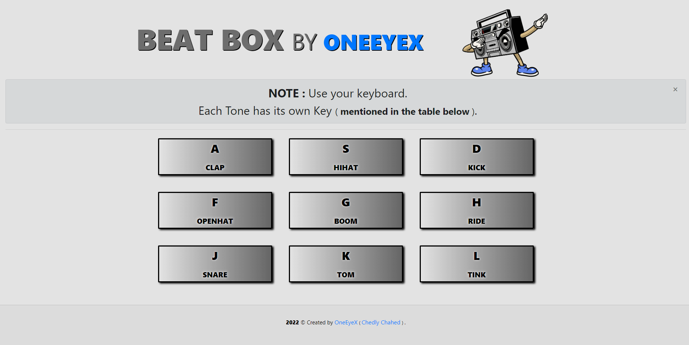

# BeatBox-By-OneEyeX
BeatBox By OneEyeX is a music app that lets you try your own beat. Choose your musical style among 9 impressive atmospheres and start to lay down and enjoy your mix.

# You can TRY it using this link: https://oneeyex.github.io/BeatBox-By-OneEyeX/

<div id="top"></div>

[![Contributors][contributors-shield]][contributors-url]
[![Forks][forks-shield]][forks-url]
[![Stargazers][stars-shield]][stars-url]
[![Issues][issues-shield]][issues-url]
[![MIT License][license-shield]][license-url]
[![LinkedIn][linkedin-shield]][linkedin-url]


<!-- PROJECT LOGO -->
<br />
<div align="center">
  <a href="https://github.com/OneEyeX/BeatBox-By-OneEyeX
/">
    
  </a>

  <h3 align="center">BeatBox by OneEyeX</h3>

  <p align="center">
   BeatBox By OneEyeX is a music app that lets you try your own beat. Choose your musical style among 9 impressive atmospheres and start to lay down and enjoy your mix. <br />
    <!-- <a href="#"><strong>Explore the docs »</strong></a> -->
    <br />
    <br />
    <a href="https://oneeyex.github.io/BeatBox-By-OneEyeX
/">View Demo</a>
    ·
    <a href="https://github.com/OneEyeX/BeatBox-By-OneEyeX
/issues">Report Bug</a>
    ·
    <a href="https://github.com/OneEyeX/BeatBox-By-OneEyeX
/issues">Request Feature</a>
  </p>
</div>


<!-- TABLE OF CONTENTS -->
<details>
  <summary>Table of Contents</summary>
  <ol>
    <li>
      <a href="#about-the-project">About The Project</a>
      <ul>
        <li><a href="#built-with">Built With</a></li>
      </ul>
    </li>
    <li>
      <a href="#getting-started">Getting Started</a>
      <ul>
        <li><a href="#installation">Installation</a></li>
      </ul>
    </li>
    <li><a href="#contributing">Contributing</a></li>
    <li><a href="#license">License</a></li>
    <li><a href="#contact">Contact</a></li>
    
  </ol>
</details>


<!-- ABOUT THE PROJECT -->
## About The Project

BeatBox By OneEyeX is a music app that lets you try your own beat. Choose your musical style among 9 impressive atmospheres and start to lay down and enjoy your mix.
# Game screenshots from PC:


 
<p align="right">(<a href="#top">back to top</a>)</p>


 
### Built With
 
* [HTML](https://fr.wikipedia.org/wiki/Hypertext_Markup_Language)
* [CSS](https://fr.wikipedia.org/wiki/Feuilles_de_style_en_cascade)
* [Bootstrap](https://getbootstrap.com/)
* [JS](https://javascript.com/)

<p align="right">(<a href="#top">back to top</a>)</p>


<!-- GETTING STARTED -->
## Getting Started

This is an example of how you may give instructions on setting up your project locally.
To get a local copy up and running follow these simple example steps.

 
### Installation

_Below is an example of how you can instruct your audience on installing and setting up the app. This template doesn't rely on any external dependencies or services._
 
1. Clone the repo by running
   ```sh
   git clone https://github.com/OneEyeX/BeatBox-By-OneEyeX.git
   ```
2. that's all

<p align="right">(<a href="#top">back to top</a>)</p>


<!-- USAGE EXAMPLES -->
<!-- ## Usage / Additional screenshots from mobile devices

# Game screenshots from a mobile device:

 

<p align="right">(<a href="#top">back to top</a>)</p>
 -->

 

See the [open issues](https://github.com/OneEyeX/BeatBox-By-OneEyeX/issues) for a full list of proposed features (and known issues).

<p align="right">(<a href="#top">back to top</a>)</p>


<!-- CONTRIBUTING -->
## Contributing

Contributions are what make the open source community such an amazing place to learn, inspire, and create. Any contributions you make are **greatly appreciated**.

If you have a suggestion that would make this better, please fork the repo and create a pull request. You can also simply open an issue with the tag "enhancement".
Don't forget to give the project a star! Thanks again!

1. Fork the Project
2. Create your Feature Branch (`git checkout -b feature/AmazingFeature`)
3. Commit your Changes (`git commit -m 'Add some AmazingFeature'`)
4. Push to the Branch (`git push origin feature/AmazingFeature`)
5. Open a Pull Request

<p align="right">(<a href="#top">back to top</a>)</p>


<!-- LICENSE -->
## License

Distributed under the MIT License. See `LICENSE.md` for more information.

<p align="right">(<a href="#top">back to top</a>)</p>


<!-- CONTACT -->
## Contact

Chedly Chahed - [@chedly_chahed](https://twitter.com/chedly_chahed) - **chedly.chahed@insat.u-carthage.tn**

Project Link: [https://github.com/OneEyeX/BeatBox-By-OneEyeX
](https://github.com/OneEyeX/BeatBox-By-OneEyeX
)

<p align="right">(<a href="#top">back to top</a>)</p>

 

<!-- MARKDOWN LINKS & IMAGES -->
<!--  #reference-style-links -->
[contributors-shield]: https://img.shields.io/github/contributors/OneEyeX/BeatBox-By-OneEyeX.svg?style=for-the-badge
[contributors-url]: https://github.com/OneEyeX/BeatBox-By-OneEyeX/graphs/
[forks-shield]: https://img.shields.io/github/forks/OneEyeX/BeatBox-By-OneEyeX.svg?style=for-the-badge
[forks-url]: https://github.com/OneEyeX/BeatBox-By-OneEyeX/network/members
[stars-shield]: https://img.shields.io/github/stars/OneEyeX/BeatBox-By-OneEyeX.svg?style=for-the-badge
[stars-url]: https://github.com/OneEyeX/BeatBox-By-OneEyeX/stargazers
[issues-shield]: https://img.shields.io/github/issues/othneildrew/Best-README-Template.svg?style=for-the-badge
[issues-url]: https://github.com/OneEyeX/BeatBox-By-OneEyeX/issues
[license-shield]: https://img.shields.io/github/license/OneEyeX/BeatBox-By-OneEyeX.svg?style=for-the-badge
[license-url]: https://github.com/OneEyeX/BeatBox-By-OneEyeX/LICENSE.md
[linkedin-shield]: https://img.shields.io/badge/-LinkedIn-black.svg?style=for-the-badge&logo=linkedin&colorB=555
[linkedin-url]: https://www.linkedin.com/in/chedly-chahed-a178a9196/
[product-screenshot]: img/bb.png


